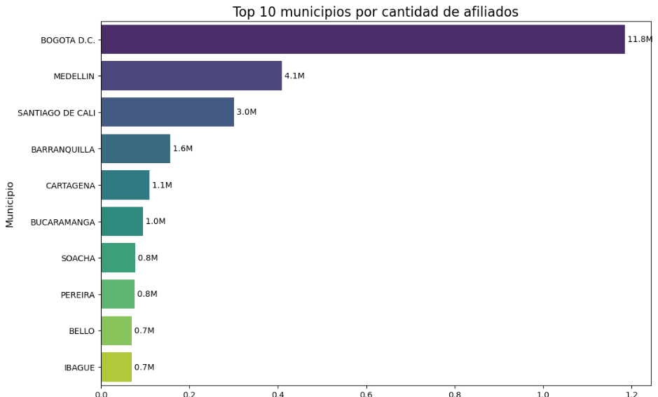

#Hyphotesis and questions:
#More than 50% of the entire country's health system affiliates (both contributory and subsidised combined) are concentrated in the three largest metropolitan areas: Bogotá D.C., Medellín (Antioquia), and Cali (Valle del Cauca).
#Question it answers: How centralized is the health system's population in the main economic hubs?
Queries about the Adres. Colombia´s National Health System

1. Resumen Ejecutivo (Executive Summary)
Este proyecto analiza la distribución geográfica de más de 46 millones de afiliados al Sistema General de Seguridad Social en Salud de Colombia. El objetivo era probar la hipótesis de que más del 50% de la población afiliada se concentra en las tres ciudades más grandes del país. 
El análisis revela que, contrario a esta suposición, estas tres ciudades representan solo el 40.94% del total, lo que indica una descentralización mayor a la esperada y resalta la importancia de las demás regiones del país.

2. La Pregunta y la Hipótesis
Pregunta de negocio: ¿Qué tan centralizada está la población del sistema de salud de Colombia en sus principales polos urbanos?

Hipótesis ("La Regla del 50+1"): Más del 50% de todos los afiliados (contributivo y subsidiado combinados) se concentran en las tres áreas metropolitanas más grandes: Bogotá D.C., Medellín y Cali.

3. Metodología y Herramientas
Datos: Se utilizó un dataset ponderado y anonimizado que representa a 46,291,518 afiliados, dividido en regímenes contributivo y subsidiado.

Herramientas:

-SQL: Para la agregación inicial de datos y la unificación de las tablas.

-Python (Pandas & Matplotlib/Seaborn): Para el análisis final, los cálculos y la visualización de datos.

4. Análisis y Hallazgos Clave
El análisis se centró en agregar el total de afiliados por municipio para identificar los centros con mayor población.

Hallazgos Principales:
El cálculo del total de afiliados en las tres ciudades principales (Bogotá, Medellín y Cali) arrojó un resultado de 18,949,695 millones de afiliados entre ambos regímenes.
Conclusión de la hipótesis: Este número representa el 40.94% del total nacional, por lo que se refuta la hipótesis del "50+1".
Se observa una clara dominancia de Bogotá D.C., que casi triplica en tamaño a la segunda ciudad, Medellín, demostrando una fuerte centralización en la capital, pero no en el conjunto de las "tres grandes".

5. Conclusiones y Próximos Pasos
Este análisis sugiere que, aunque las tres ciudades principales son vitales, las estrategias de salud pública no deben subestimar la importancia del resto del país, donde reside casi el 60% de la población afiliada. Un próximo paso lógico sería analizar la distribución del type_affiliate (Cotizante vs. Beneficiario) por región para profundizar en el análisis de la formalidad laboral.
